# Suicide_Risk_Final_Project

## Project Status 

- Segment 1: Done
- Segment 2: Done
- Segment 3: In progress 

## Regular meeting schedule:

- Daily: 2 hours 

## Project plan:

### Topic 

After the consideration of several topics and an in-depth brainstorm in our team we decided us for our final project to focus on the topic suicides and it’s prevention. Public health problems as suicides are often overseen and considered as a taboo in many societies. From our perspective that is reason enough to dig deeper and we hope that we can help with our analysis to bring attention to the topic, raise awareness and support the prevention.

### Reasons

Suicide rates have been increasing in many countries around the world. According to the World Health Organization (WHO), suicide is the fourth leading cause of death among 15-29-year-olds globally. The WHO also estimates that every 40 seconds, someone dies by suicide somewhere in the world. Suicide rates have been increasing in many high-income countries, but it's also an issue in low-income countries. Factors that contribute to the increase in suicide rates include mental health issues, such as depression and anxiety, as well as stressors such as financial problems, relationship issues, and trauma. Suicide also has a ripple effect, impacting those who know and care about the person who died by suicide. With the increasing suicide rates in recent years, the need for increased awareness, education, and resources to address this issue is getting highlighted.

In our final project we would like to investigate in-depth, which socioeconomic factors are impacting the suicide rate and how we can predict with AI and Machine Learning methodologies the outlook of the upcoming years.
  
### Questions 

- Is there a correlation between suicide risk and socio-economic status and/or health data?
- What is the most significant factors impacts suicide rate?
- What country has highest and lowest risk of suicide in the next year?

### Resources:

- Data: [Education Level](https://data.oecd.org/eduatt/adult-education-level.htm),
[Social Support](https://data.oecd.org/healthrisk/social-support.htm),
[Alcohol Consumption](https://data.oecd.org/healthrisk/alcohol-consumption.htm),
[Employment Rate](https://data.oecd.org/emp/employment-rate.htm),
[Daily Smokers](https://data.oecd.org/healthrisk/daily-smokers.htm#indicator-chart),
[Obesity](https://data.oecd.org/healthrisk/overweight-or-obese-population.htm#indicator-chart),
[Health Speding](https://data.oecd.org/healthres/health-spending.htm),
[Social Speding](https://data.oecd.org/socialexp/social-spending.htm),
[Poverty](https://data.oecd.org/inequality/poverty-rate.htm),
[Suicide Rate](https://data.oecd.org/healthstat/suicide-rates.htm),
[Reasons Source](https://afsp.org/suicide-statistics/),
[Suicide Article](https://www.who.int/news-room/fact-sheets/detail/suicide),
[Mental health at work](https://www.who.int/news-room/fact-sheets/detail/mental-health-at-work#:~:text=They%20may%20include%20giving%20individual,regular%20supportive%20meetings%20with%20supervisors),
[Community Strategies to Reduce Excessive Alcohol Use](https://www.cdc.gov/cancer/alcohol/reducing-excessive-alcohol-use/community-strategies.htm),
[Reducing harm due to alcohol: success stories from 3 countries](https://www.who.int/europe/news/item/15-04-2021-reducing-harm-due-to-alcohol-success-stories-from-3-countries)

- Source: Pandas, Jupyter Notebook, SQL, PostgreSQL, DBD, Visual Studio.

### Data Description
- **Education Data:** There are 5 columns: **LocationTime** column is a unique value to identify the other factors. **LOCATION** column has the countries names (Argentina, Australia, Austria, Belgium, Brazil, Canada, Chile, China, Colombia, Costa Risa, Czech Republic, Denmark, Estonia, Finland, France, Germany, Greece, Hungary, Iceland, India, Indonesia, Ireland, Israel, Italy, South Korea, Latvia, Lithuania, Luxembourg, Mexico, Netherlands, New Zealand, Norway, Poland, Portugal, Russia, Slovak Republic, Slovenia, South Africa, Spain, Sweden, Switzerland, Türkiye, United Kingdom, United States). **TIME** column contains the year data. **Edu_sec_val** indicates the percentage for upper-secondary education.  **Edu_try_val**,   indicates the percentage for tertiary education
- **Employment Rate:** There are 4 columns: **LocationTime** column is a unique value to identify the other factors. **LOCATION** column has the countries names (Argentina, Australia, Austria, Belgium, Brazil, Canada, Chile, China, Colombia, Costa Risa, Czech Republic, Denmark, Estonia, Finland, France, Germany, Greece, Hungary, Iceland, India, Indonesia, Ireland, Israel, Italy, South Korea, Latvia, Lithuania, Luxembourg, Mexico, Netherlands, New Zealand, Norway, Poland, Portugal, Russia, Slovak Republic, Slovenia, South Africa, Spain, Sweden, Switzerland, Türkiye, United Kingdom, United States). **TIME** column contains the year data. **emp_val** indicates the percentage of people working.
- **Suicide Rate:** There are 6 columns: **LocationTime** column is a unique value to identify the other factors. **LOCATION** column has the countries names (Argentina, Australia, Austria, Belgium, Brazil, Canada, Chile, China, Colombia, Costa Risa, Czech Republic, Denmark, Estonia, Finland, France, Germany, Greece, Hungary, Iceland, India, Indonesia, Ireland, Israel, Italy, South Korea, Latvia, Lithuania, Luxembourg, Mexico, Netherlands, New Zealand, Norway, Poland, Portugal, Russia, Slovak Republic, Slovenia, South Africa, Spain, Sweden, Switzerland, Türkiye, United Kingdom, United States). **TIME** column contains the year data. **Suicide_val_MEN**,  is presented as total number of men in terms of deaths per 100 000 inhabitants (total). **Suicide_val_TOT**, represents the total numbers in terms of deaths per 100 000 inhabitants (total). **Suicide_val_WOMEN**, indicates the total number of woman in terms of deaths per 100 000 inhabitants (total). 
- **Smoking Rate:** There are 4 columns: **LocationTime** column is a unique value to identify the other factors. **LOCATION** column has the countries names (Argentina, Australia, Austria, Belgium, Brazil, Canada, Chile, China, Colombia, Costa Risa, Czech Republic, Denmark, Estonia, Finland, France, Germany, Greece, Hungary, Iceland, India, Indonesia, Ireland, Israel, Italy, South Korea, Latvia, Lithuania, Luxembourg, Mexico, Netherlands, New Zealand, Norway, Poland, Portugal, Russia, Slovak Republic, Slovenia, South Africa, Spain, Sweden, Switzerland, Türkiye, United Kingdom, United States). **TIME** column contains the year data. **Smoking_Val**  indicates as a total and per gender and is measured as a percentage of the population considered (total, men or women) aged 15 years and over. 
- **Obesity Rate:**  There are 4 columns: **LocationTime** column is a unique value to identify the other factors. **LOCATION** column has the countries names (Argentina, Australia, Austria, Belgium, Brazil, Canada, Chile, China, Colombia, Costa Risa, Czech Republic, Denmark, Estonia, Finland, France, Germany, Greece, Hungary, Iceland, India, Indonesia, Ireland, Israel, Italy, South Korea, Latvia, Lithuania, Luxembourg, Mexico, Netherlands, New Zealand, Norway, Poland, Portugal, Russia, Slovak Republic, Slovenia, South Africa, Spain, Sweden, Switzerland, Türkiye, United Kingdom, United States). **TIME** column contains the year data. **obesity_val** is based on the body mass index (BMI), measured as a percentage of the population aged 15 years and older.  
- **Social Spending Rate:** There are 4 columns: **LocationTime** column is a unique value to identify the other factors. **LOCATION** column has the countries names (Argentina, Australia, Austria, Belgium, Brazil, Canada, Chile, China, Colombia, Costa Risa, Czech Republic, Denmark, Estonia, Finland, France, Germany, Greece, Hungary, Iceland, India, Indonesia, Ireland, Israel, Italy, South Korea, Latvia, Lithuania, Luxembourg, Mexico, Netherlands, New Zealand, Norway, Poland, Portugal, Russia, Slovak Republic, Slovenia, South Africa, Spain, Sweden, Switzerland, Türkiye, United Kingdom, United States). **TIME** column contains the year data. **Soc_Spend_Val** column contains indicator is measured as a percentage of GDP or USD per capita, comprises cash benefits, direct in-kind provision of goods and services, and tax breaks with social purposes.
- **Health Spending Rate:** There are 4 columns: **LocationTime** column is a unique value to identify the other factors. **LOCATION** column has the countries names (Argentina, Australia, Austria, Belgium, Brazil, Canada, Chile, China, Colombia, Costa Risa, Czech Republic, Denmark, Estonia, Finland, France, Germany, Greece, Hungary, Iceland, India, Indonesia, Ireland, Israel, Italy, South Korea, Latvia, Lithuania, Luxembourg, Mexico, Netherlands, New Zealand, Norway, Poland, Portugal, Russia, Slovak Republic, Slovenia, South Africa, Spain, Sweden, Switzerland, Türkiye, United Kingdom, United States). **TIME** column contains the year data. **healthy_spend_val** is measured as a share of GDP, as a share of total health spending and in USD per capita. 
- **Alcohol consumption:** There are 4 columns: **LocationTime** column is a unique value to identify the other factors. **LOCATION** column has the countries names (Argentina, Australia, Austria, Belgium, Brazil, Canada, Chile, China, Colombia, Costa Risa, Czech Republic, Denmark, Estonia, Finland, France, Germany, Greece, Hungary, Iceland, India, Indonesia, Ireland, Israel, Italy, South Korea, Latvia, Lithuania, Luxembourg, Mexico, Netherlands, New Zealand, Norway, Poland, Portugal, Russia, Slovak Republic, Slovenia, South Africa, Spain, Sweden, Switzerland, Türkiye, United Kingdom, United States). **TIME** column contains the year data.  **Alcohol_val**  is defined as annual sales of pure alcohol in litres per person aged 15 years and older.
- **Work Hour data:** There are 4 columns: **LocationTime** column is a unique value to identify the other factors. **LOCATION** column has the countries names (Argentina, Australia, Austria, Belgium, Brazil, Canada, Chile, China, Colombia, Costa Risa, Czech Republic, Denmark, Estonia, Finland, France, Germany, Greece, Hungary, Iceland, India, Indonesia, Ireland, Israel, Italy, South Korea, Latvia, Lithuania, Luxembourg, Mexico, Netherlands, New Zealand, Norway, Poland, Portugal, Russia, Slovak Republic, Slovenia, South Africa, Spain, Sweden, Switzerland, Türkiye, United Kingdom, United States). **TIME** column contains the year data.  **Work_Hour_Value_TOT** is measured in terms of hours per worker per year.
- **Final suicide dataset:**  There are 13  columns: **LocationTime** column is a unique value to identify the other factors. **Suicide_Val_TOT** represents the total numbers in terms of deaths per 100 000 inhabitants (total). **Alcohol_Val** is defined as annual sales of pure alcohol in litres per person aged 15 years and older. **Edu_Sec_Val** indicates the total percentage for secondary education. **Edu_Try_Val** indicates the total percentage for tertiary education. **Emp_Val** indicates the percentage of people working. **Healthy_Spend_Val** is measured as a share of GDP, as a share of total health spending and in USD per capita. **Obesity_Val** is based on the body mass index (BMI), measured as a percentage of the population aged 15 years and older. **Smoking_Val** indicates as a total and per gender and is measured as a percentage of the population considered (total, men or women) aged 15 years and over. **Soc_Spend_Val** column contains indicator is measured as a percentage of GDP or USD per capita, comprises cash benefits, direct in-kind provision of goods and services, and tax breaks with social purposes. **Work_Hour_Value_TOT** is measured in terms of hours per worker per year.

### Data Cleaning Process 

The raw data was cleaned in the following steps:
1. Verify data types for each column to ensure they are in the correct format
2. Convert the 'TIME' column from integer to string 
3. Create a new column 'LocationTime' by combining the values from the 
'LOCATION' and 'TIME' columns to create a unique identifier 
4. Change the 'TIME' column back to integer
5. Verify data types once more to ensure correct format
6. Remove irrelevant columns such as 'Flag Codes', 'MEASURE', 'INDICATOR', 'FREQUENCY'
7. Check for and handle any null values
8. Filter the 'TIME' column to only include values between 1990 and 2020
9. Reorganize the columns into this order: 'LocationTime','LOCATION','SUBJECT','TIME', 'Value'
10. Rename the "Value" column to a descriptive name, such as "Edu_Sec_Val" 
11. Create separate columns for each "SUBJECT" group by using a pivot table. 
12. Check for missing values and handle them appropriately.
13. Combine the separate "Subject" columns into a single "Obesity_val" column
14. Retain additional columns in the Education dataset, such as "Edu_Sec_Val" and "Edu_Try_Val."
15. Merge all datasets into a final "Suicide_ValuesIn.csv" dataset based on the "LocationTime" column.
16. After merging, remove unnecessary columns such as "Location" and "Time."

The cleaned data was then saved as new files, 'alcohol_clean.csv', 'smoker_clean.csv', 'social_spending_clean.csv', 'employment_clean.csv', 'obesity_clean.csv', 'education_clean.csv' 'health_speding_clean.csv', 'suicide_rate_clean.csv' for further analysis.

After moerged, we have one dataset  ‘Suicide_valuesIn.csv’.

### ERD 
To create the ERD diagram:

- we first cleaned up the data and looking at the clean files
- we reviewed which were primary keys, foreign keys, and the data types of each of the columns. 
- We then utilized quick DBD to create our diagram. 
- All tables had LocationTime which is how they are joined to the suicide rate table.

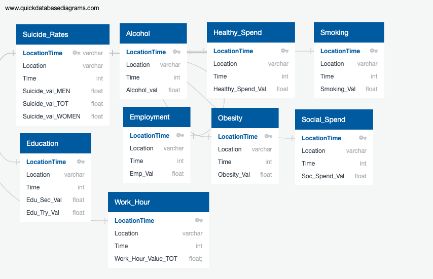.

### Database 

- We utilized the Postgress application to create and hold our database and tables.
- The ERD that was created helped with the table creation We began by first creating a database for the Suicide Risks. 
- Then, we created a new table for each of csv clean data files we would be using.
- We utilized the “CREATE TABLE” function to create each of the tables. 
- Once the tables were created, the clean version of the files were uploaded. We did run into an error where the data column format that we had did not match the table that was created.
- We went back and had to drop the table and re-upload the clean csv files. In addition, the ERD was also corrected.
- We went back and had to drop the table and re-upload the clean csv files. In addition, the ERD was also corrected.
- We went back to the tables and drop ‘Social_support’ and ‘Poverty’ tables
- All the other tables we drop the ‘Indicator’ and ‘Subject’ columns

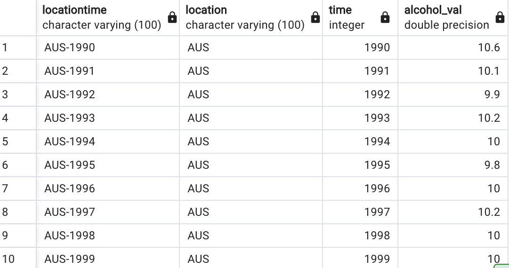.

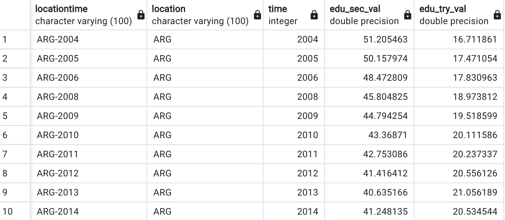.

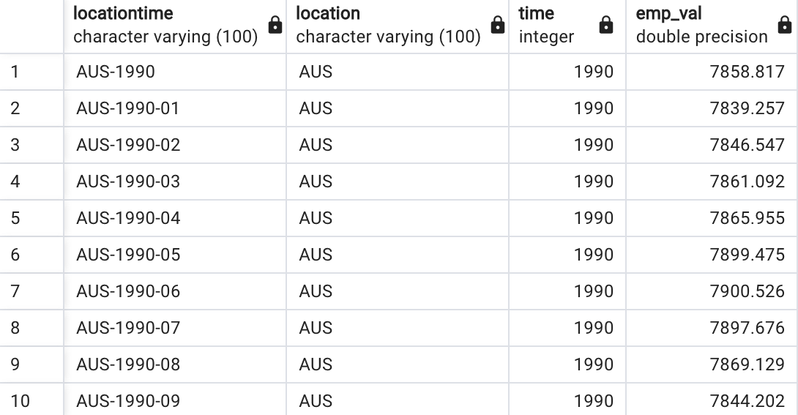.

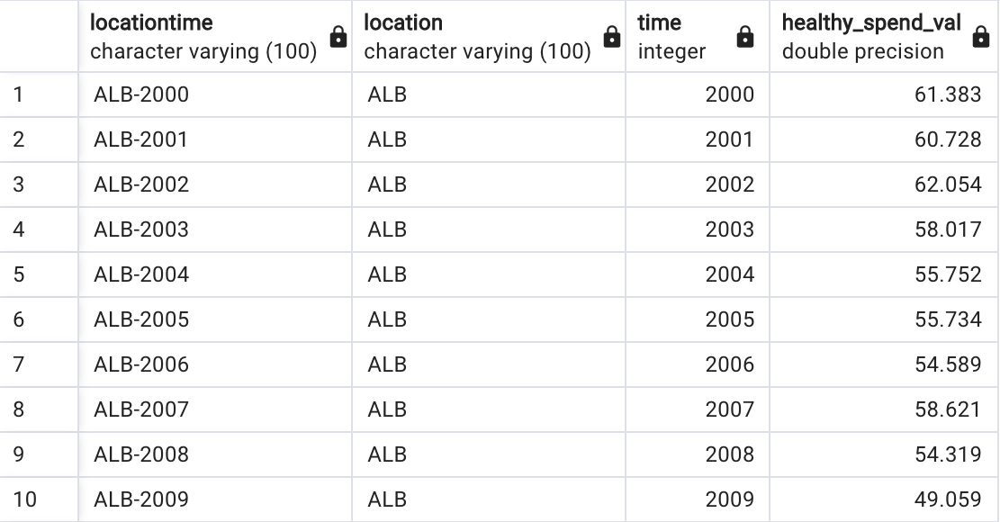.

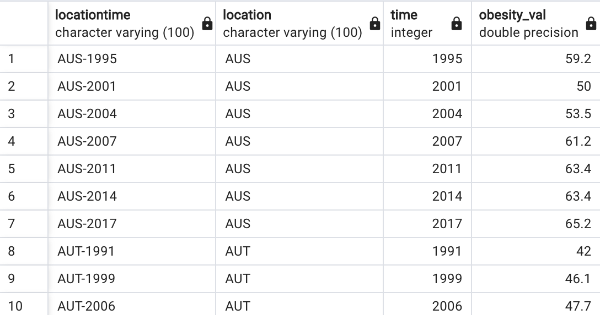.

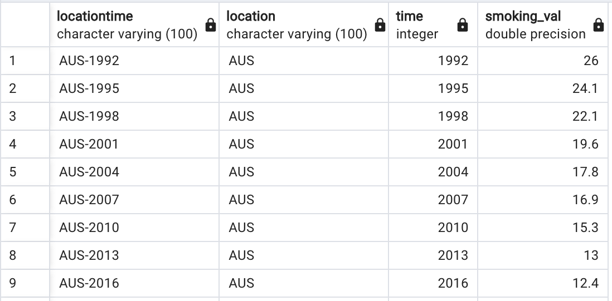.

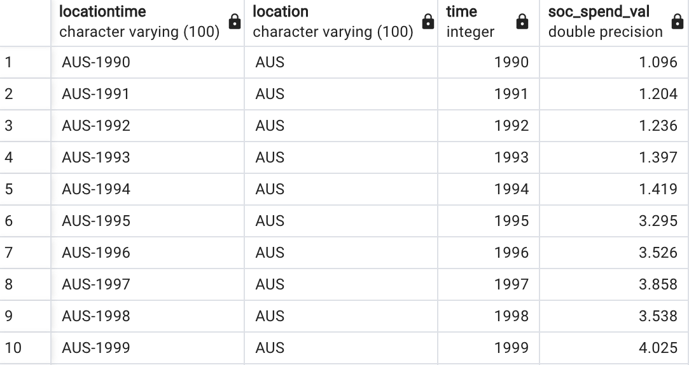.

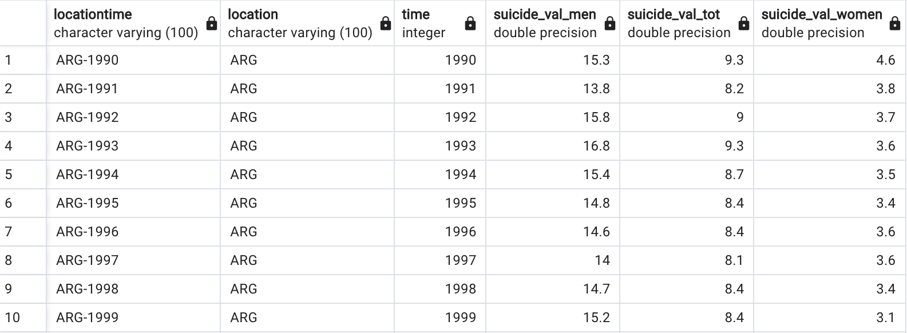.

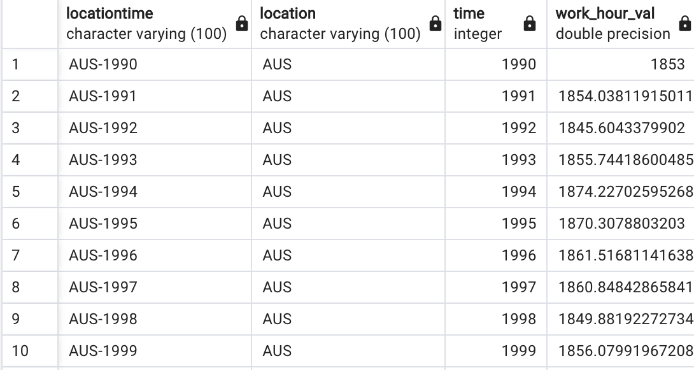.

### Machine Learning 

- **Multiple Linear Regression Model** The aim of our project is to develop a model to predict suicide rates in 1, 3, and 5 years Organisation for Economic Co-operation and Development (OECD) countries while also identifying determinants with the most impact. The purpose is to hopefully gain insight on major determinants that heavily increase or decrease suicide rates in these countries. To achieve this goal, our team has decided to utilize a Supervised Learning Multiple Linear Regression Model. A Supervised Learning Regression Model strengths include exhibiting the relationships between variables while also being able to predict values.  We feel this type of model is the best fit to accomplish our goal of creating a predictive model for future use. In order to train this model we will use the sklearn train split function.The accuracy of our models is not very high which may be a concern. This model works by taking the individual features and corresponding suicide data points to create a line of regression intended to predict suicide rates based on the specific feature. If we see an upward trend we can infer there is a correlation between the feature and increasing suicide rates. If we had more time I we would want to implement This will make our model a valuable tool in not only forecasting a trends of suicide rates, but also spotlighting the potential characters that will have a lasting effect on people’s health. I think the model at its current state is very poor so if we had more time I would definitely explore ways to increase the R-squared value and perhaps look into ways to improve the scaling of the data.

**Multiple Linear Prediction**

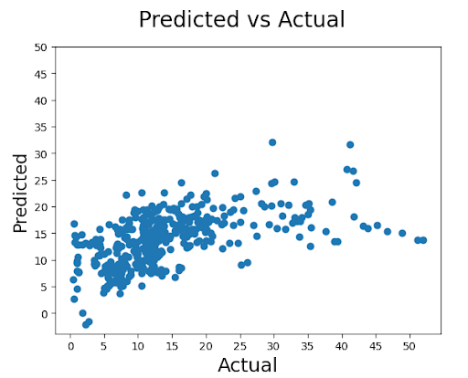.

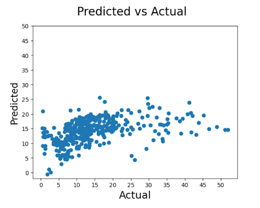.

**Multiple Linear Accuracy**

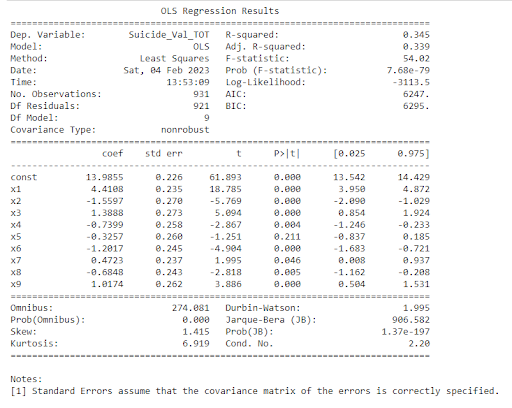.

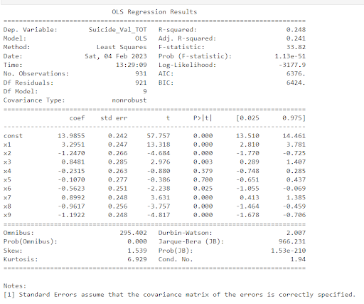.

- **Random Forest** As a second ML model we decided to use a Random Forest Regressor model for analysing our dataset. A Random Forest Regressor Model has several advantages over other regression algorithms like an improved accuracy, handling non- linear relationships, little pre-processing required, robust outliers and shows a feature importance. Especially important and exciting for us is to analyse and explore  the feature importance and their impact on the suicide rates. To know which factors are especially impacting the suicide rates can give our analysis a valuable depth and support people’s health in the longterm. 

**Random Forest Prediction**

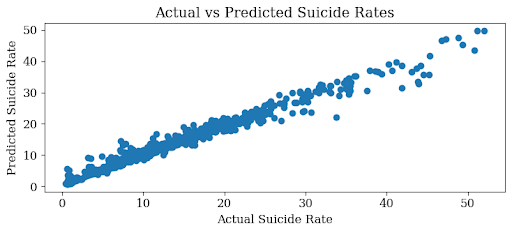.

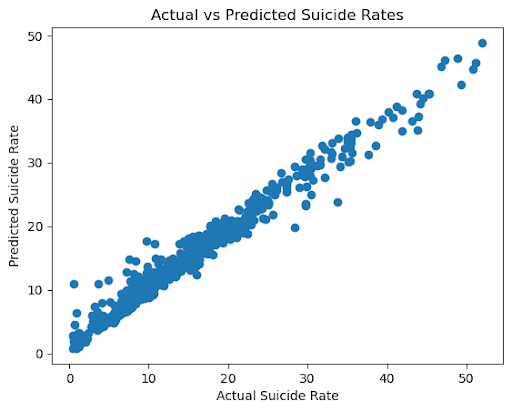.

**Random Forest Accuracy**

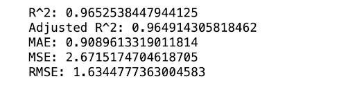.

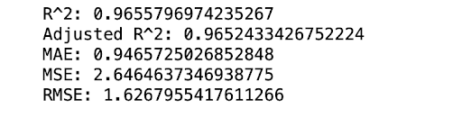.

**Random Forest Features**

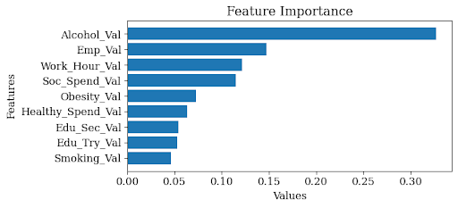.

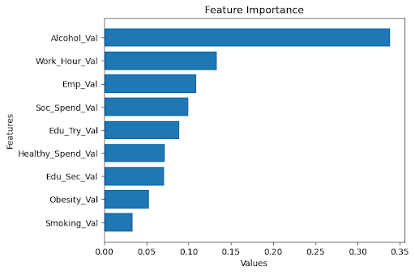.

[Machine Learing](https://docs.google.com/document/d/12KtiykpAun2tfJR4kHSIHeCfb0YqpiUXnc6vTmCaVhE/edit?usp=sharing)

### Dashboard 

A Tableau dashboard was created using the most recent data on suicides, including various factors such as age, gender, location, and methods used. This dashboard provides valuable insights and visualizations on the trends and patterns in suicides, allowing for a comprehensive analysis of the issue and its contributing factors. This information can help inform decision making and guide the development of effective strategies to prevent suicides and support those in need.

## Conclusion 
### Prevention Plan 
- Alcohol consumption

**Taxes over price:** Increasing the price of alcohol through taxes or minimum pricing policies.

**Restricting availability** Restricting availability of alcohol, such as reducing the number of retail outlets, limiting sale hours and alcohol advertisement

**Education:** Providing education and social support for individuals, especially those at higher risk of harmful drinking.

- Work hours 

**Foster positive relationships:** Encourage positive and supportive relationships between coworkers and supervisors, and address conflicts in a constructive manner.

**Encourage open conversation about mental health:** Break the stigma surrounding mental health and encourage open conversation about the topic.

**Encourage a healthy work-life balance:** Encourage employees to take breaks, set boundaries between work and personal life, and prioritize self-care.

### Recommendations

During this project our group realized suicide is a complex issue that is not easily remedied by fixing a handful of factors. It is a multifaceted problem that requires more attention in order to work towards solutions.

- Weather data
- Mental health
- Immigration status
- Cultural views

Suicide is not a topic where there is a universal solution. Each country needs to implement a suicide prevention plan that is tailored towards their unique cultures and the needs of their people. However, it is not just up to positions of power to prevent suicides, communities must also band together to do their part to ensure everyone can lead a healthy and fulfilling
